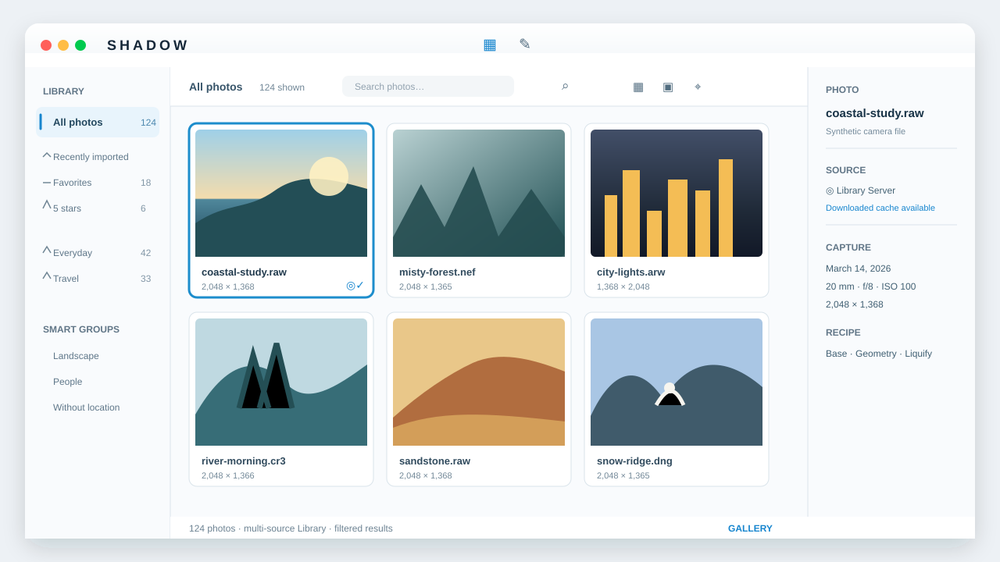
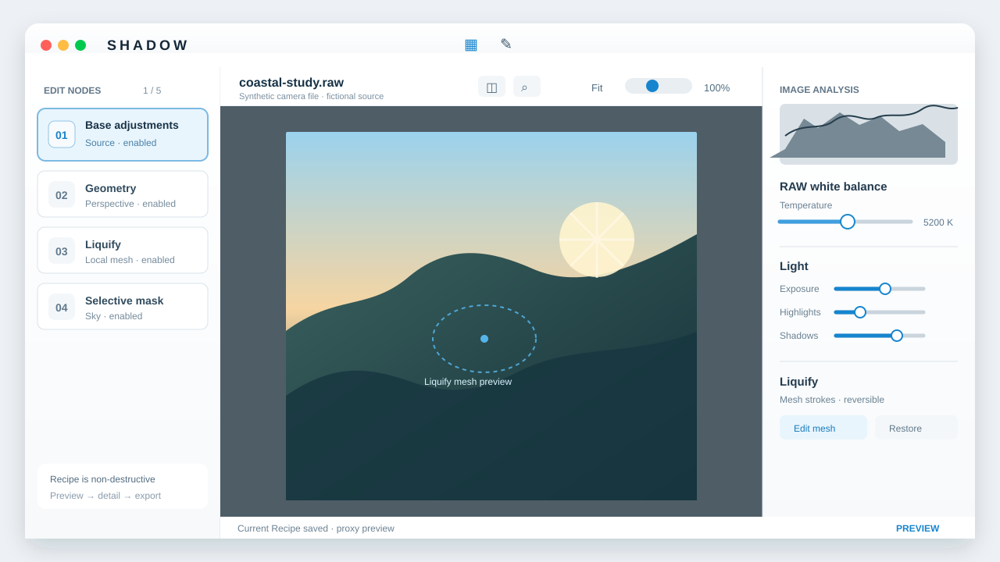

# Shadow

[中文](#中文) · [English](#english)

---

<a id="中文"></a>

## 中文

> **快速迭代开发中。** Shadow 的功能、交互与持久化格式仍会快速调整；请把当前版本视为可体验的开发预览，而非稳定发布。

Shadow 是一个本地优先、非破坏性的摄影工作空间：把图库、选片、RAW 编辑与可选的局域网图库连接放在同一套照片身份与 Recipe 之上。



*图库概念示意图，所有照片、名称、数值与状态均为合成数据。*



*节点编辑概念示意图，突出 Recipe、局部蒙版与液化网格。*

### 设计理念

- **原片不动**：编辑、评分、标签、位置补全和导出设置都以独立、可追溯的状态保存。
- **照片先于路径**：同一张照片可以有多个来源与表现形式；本地目录、远程图库和下载缓存不会改变它的逻辑身份。
- **一个 Recipe，多种执行路径**：预览、精修与导出可以采用不同质量或硬件路径，但都来自同一套编辑语义。
- **AI 是辅助，不是裁决**：人物、语义、降噪和位置参考都服务于人工判断；不会静默替你改动原片或替你做选择。

### 当前能力

- 本地文件夹与远程图库的统一浏览、筛选、评分、颜色标记、相册与多来源照片模型。
- 选片、候选竞技场与并排比较；筛选过程不强迫产生“保留/删除”的破坏性动作。
- 非破坏性 RAW 调整、裁剪、几何、局部蒙版、修复、液化、AI RAW 降噪与节点式编辑流程。
- 图库地图、逆地理信息、手动补全位置，以及按拍摄事件分组的缺失位置核对。
- 可管理的导出预设、水印与本机 Shadow Library Server。

### 尝试开发版

已有准备好的本地开发环境时，启动当前 canonical debug：

```sh
./scripts/run_debug.sh
```

需要重新构建并提升时：

```sh
./scripts/build_and_promote_debug.sh
```

默认提升流程会复用已有验证，避免每次运行完整测试。需要额外启动冒烟验证时使用：

```sh
cargo xtask desktop-build-promote --verify
```

环境准备、私有本地资产与开发细节见[开发指南](docs/development/README.md)。

### 项目导航

- [开发文档](docs/README.md)
- [架构与仓库地图](docs/architecture/README.md)
- [桌面应用导航](apps/desktop/README.md)
- [Library Server 运维说明](docs/operations/library-server.md)
- [第三方来源与许可](THIRD_PARTY.md)

---

<a id="english"></a>

## English

> **Rapidly evolving.** Features, interaction details, and persistent formats are still moving quickly. Treat the current build as a usable development preview, not a stable release.

Shadow is a local-first, non-destructive photography workspace. Library browsing, culling, RAW development, and optional LAN Libraries share one photo identity and Recipe model.


*Gallery concept illustration; all photos, names, values, and states are synthetic.*


*Node-editing concept illustration, emphasizing Recipe, local masks, and Liquify mesh editing.*

### Principles

- **Originals stay untouched**: edits, ratings, organization, location completion, and export settings remain separate, traceable state.
- **Photos before paths**: one logical photo may have several sources and representations; folders, remote Libraries, and downloaded caches do not redefine identity.
- **One Recipe, several execution paths**: preview, detail, and export may differ in quality or hardware route while sharing one editing meaning.
- **AI assists, never decides**: people, semantic discovery, denoise, and location evidence support human judgment rather than silently changing originals or making choices.

### Current capabilities

- Unified local-folder and remote-Library browsing, filtering, ratings, color labels, albums, and multi-source photo identity.
- Culling, a candidate arena, and side-by-side comparison without forcing destructive keep/delete actions.
- Non-destructive RAW adjustments, crop, geometry, local masks, retouch, Liquify, AI RAW Denoise, and a node-based editing workflow.
- Library maps, reverse-geographic information, manual location completion, and capture-event grouping for photos without GPS.
- Export presets, watermark management, and a local Shadow Library Server.

### Run the development build

With an existing local development setup, launch the current canonical debug build:

```sh
./scripts/run_debug.sh
```

To rebuild and promote a new one:

```sh
./scripts/build_and_promote_debug.sh
```

The default promotion reuses existing validation. Add startup smoke coverage only when needed:

```sh
cargo xtask desktop-build-promote --verify
```

See the [Development guide](docs/development/README.md) for setup, private local assets, and engineering details.

### Project navigation

- [Developer documentation](docs/README.md)
- [Architecture and repository map](docs/architecture/README.md)
- [Desktop application guide](apps/desktop/README.md)
- [Library Server operations](docs/operations/library-server.md)
- [Third-party provenance](THIRD_PARTY.md)

## License

Shadow is free software under the GNU General Public License, version 3 or later
(`GPL-3.0-or-later`). See [LICENSE](LICENSE).

The public distribution contains no vendor SDK, private camera profile, or private decoder-provider implementation. Imported assets retain their provenance and licenses in [THIRD_PARTY.md](THIRD_PARTY.md).
