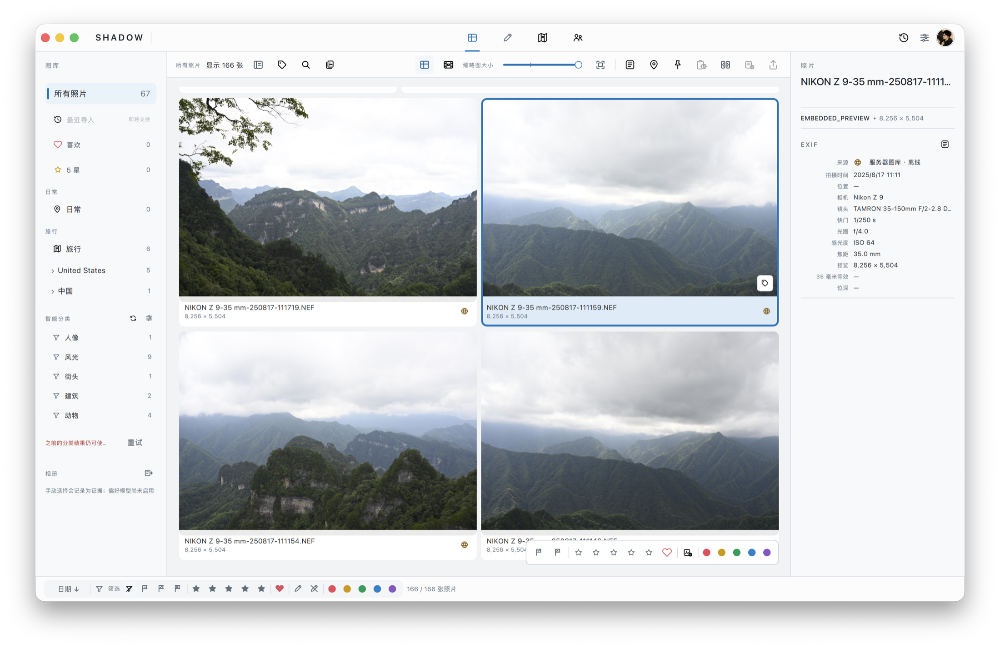
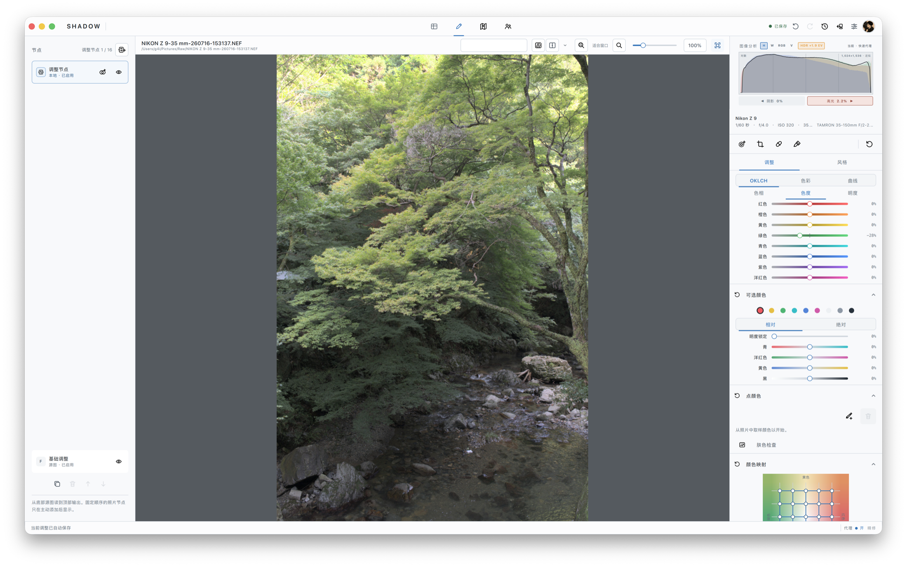

# Shadow

[中文](#中文) · [English](#english)

---

<a id="中文"></a>

## 中文

> **开发预览。** Shadow 仍在快速迭代，功能、交互和持久化格式都可能调整。建议使用独立测试图库体验，并为重要工作保留备份。

Shadow 是一款处于开发阶段的照片管理与 RAW 编辑应用。调色、蒙版与局部处理以节点组织，使各项调整具有明确的顺序和作用范围，并可独立修改或组合。

Shadow 同时面向 AI 参与的摄影工作流设计。长期目标是在用户控制下学习选片、调色与局部处理偏好，并将其用于图库管理与照片处理。相关能力仍处于设计与建设阶段；当前版本主要提供节点化编辑，以及人物、语义、降噪和选择性蒙版等基础能力。



*Shadow 图库工作区：网格浏览、智能分类与照片信息。*



*Shadow 精修工作区：节点 Recipe、照片预览与调色控制。*

### 设计方向

- **节点化编辑**：调色、几何、蒙版和局部处理共同构成节点 Recipe；各节点具有明确的顺序、作用范围和可调参数。
- **AI 参与编辑流程**：主体和人物细节选择会自动创建并绑定新的调色节点，后续调整沿用同一节点结构。
- **偏好学习**：这是产品的长期方向。目标是根据用户的比较、选择和调整逐渐理解其摄影偏好，并据此协助管理和处理照片。
- **用户控制**：识别结果和未来的偏好建议保持可见、可调整、可撤销；原片保持只读。

### 当前可体验

- **图库与整理**：导入本地文件夹，连接可选的局域网 Library；按照片身份合并多来源与 RAW/JPEG 等表现形式，并通过网格、胶片带、地图、筛选、评分、颜色标记、关键词、相册和检查器组织照片。
- **选片**：并排比较与候选竞技场支持海选和逐轮比较，并以“更好”“同等”等判断记录选择过程。
- **非破坏性精修**：节点化 Recipe 覆盖基础 RAW 开发、白平衡、色调与颜色、裁剪、旋转、透视/几何、局部蒙版、修复和液化；AI 主体与人物细节选择会自动创建并绑定新的调色节点。
- **本地智能辅助**：人物分组、语义发现、AI RAW 降噪、焦点细节检查以及基于 SAM 2.1 和人脸解析的选择性蒙版，通过本地 Infer Runtime 执行并保留来源与执行信息。
- **位置与交付**：地图浏览、逆地理信息、手动位置补全、无 GPS 照片的拍摄事件聚类，以及导出预设、格式/尺寸/质量控制和水印管理。

### 当前边界

- Shadow 当前处于开发预览阶段，Catalog、Recipe 与交互格式仍可能调整。
- RAW、镜头校正与 AI 功能的支持范围仍在扩展；不可用的能力会明确报告。
- 受许可、版权及公开实现等限制，部分厂商 RAW 解码目前不在 Shadow 的支持范围内。
- Shadow 提供通用 provider 接口，用于支持可能的兼容实现；接口本身不代表相应格式已经受支持。
- 公共仓库不分发模型文件。

### 运行开发版

已有准备好的本地开发环境时，可启动当前 canonical debug：

```sh
./scripts/run_debug.sh
```

环境准备、构建验证、私有本地资产和 Debug 提升流程见[开发指南](docs/development/README.md)。

### 项目导航

- [开发文档](docs/README.md)
- [架构与仓库地图](docs/architecture/README.md)
- [桌面应用导航](apps/desktop/README.md)
- [Library Server 运维说明](docs/operations/library-server.md)
- [第三方来源与许可](THIRD_PARTY.md)

---

<a id="english"></a>

## English

> **Development preview.** Shadow is evolving quickly, and features, interactions, and persistent formats may change. Use a separate test Library and keep backups of important work.

Shadow is a photo-management and RAW-editing application in development. Tone, masks, and local adjustments are organized as nodes, giving each operation an explicit order and scope while keeping it independently adjustable and composable.

Shadow is also designed for photographic workflows in which AI participates. The long-term goal is to learn the user's culling, color, and local-editing preferences under user control, and apply them to Library management and image processing. These capabilities remain under design and development; the current build primarily provides node-based editing and foundational people, semantic, denoise, and selective-mask capabilities.


*Shadow Gallery workspace with grid browsing, intelligent categories, and photo information.*


*Shadow Precision workspace with a node Recipe, photo preview, and color controls.*

### Design direction

- **Node-based editing**: tone, geometry, masks, and local processing form one node Recipe. Each node has explicit ordering, scope, and adjustable parameters.
- **AI in the editing workflow**: subject and people-detail selections automatically create and bind a new grading node; subsequent adjustments use the same node structure.
- **Preference learning**: this is a long-term product direction. The goal is to develop an understanding of the user's photographic preferences from comparisons, selections, and adjustments, then use it to assist with management and processing.
- **User control**: recognition results and future preference-driven suggestions remain visible, adjustable, and reversible; originals remain read-only.

### Available in the current build

- **Library and organization**: import local folders and connect an optional LAN Library; merge multiple sources and representations such as RAW/JPEG by photo identity, then organize them through grid, filmstrip, map, filters, ratings, color labels, keywords, albums, and inspectors.
- **Culling**: side-by-side comparison and a candidate arena support shortlisting and successive rounds, recording the selection process through judgments such as “better” and “equal.”
- **Non-destructive refinement**: a node-based Recipe covers foundational RAW development, white balance, tone and color, crop, rotation, perspective/geometry, local masks, retouch, and Liquify. AI subject and people-detail selections automatically create and bind a new grading node.
- **Local intelligent assistance**: people grouping, semantic discovery, AI RAW denoise, focus-detail inspection, and selective masks based on SAM 2.1 and face parsing run through the local Infer Runtime and retain source and execution information.
- **Location and delivery**: map browsing, reverse-geographic information, manual location completion, capture-event grouping for photos without GPS, plus export presets, format/size/quality control, and watermark management.

### Current boundaries

- Shadow is currently a development preview. Catalog, Recipe, and interaction formats may continue to change.
- Support coverage for RAW, lens correction, and AI capabilities is still expanding; unavailable capabilities are reported explicitly.
- Licensing, copyright, and the availability of public implementations limit current support for some vendor RAW formats.
- Shadow provides a general provider interface for possible compatible implementations; the interface itself does not imply support for those formats.
- The public repository does not distribute model files.

### Run the development build

With an existing local development setup, launch the current canonical debug build:

```sh
./scripts/run_debug.sh
```

See the [Development guide](docs/development/README.md) for environment setup, build validation, private local assets, and Debug promotion.

### Project navigation

- [Developer documentation](docs/README.md)
- [Architecture and repository map](docs/architecture/README.md)
- [Desktop application guide](apps/desktop/README.md)
- [Library Server operations](docs/operations/library-server.md)
- [Third-party provenance](THIRD_PARTY.md)

## License

Shadow is free software under the GNU General Public License, version 3 or later (`GPL-3.0-or-later`). See [LICENSE](LICENSE).
