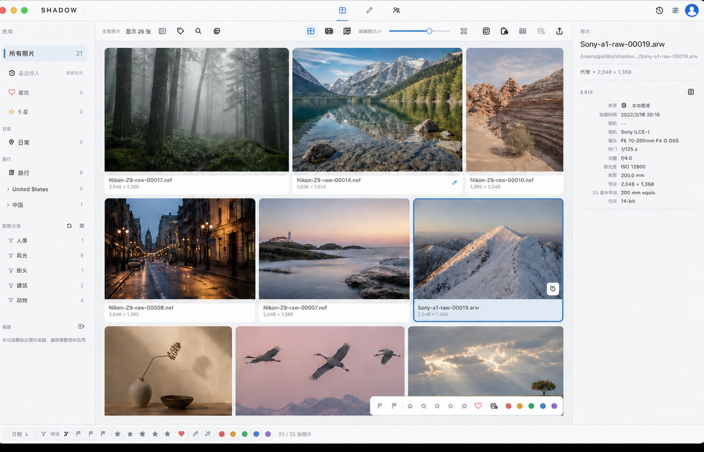
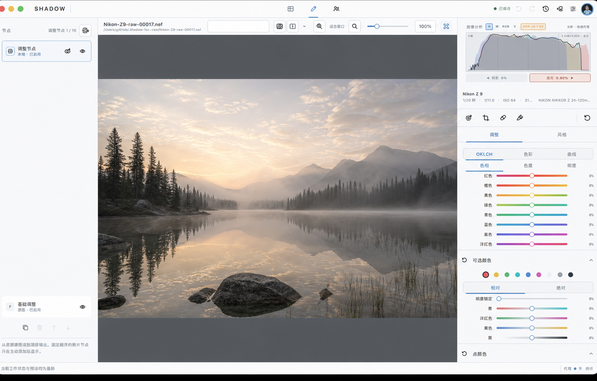

# Shadow

[中文](#中文) · [English](#english)

---

<a id="中文"></a>

## 中文

> **快速迭代开发中。** Shadow 的功能、交互与持久化格式仍会快速调整；请把当前版本视为可体验的开发预览，而非稳定发布。

Shadow 是一个本地优先、非破坏性的摄影工作空间：把图库、选片、RAW 编辑与可选的局域网图库连接放在同一套照片身份与 Recipe 之上。



*图库工作区的真实界面截图；所有照片缩略图与头像均为合成占位内容。*



*精修工作区的真实界面截图；中央照片与头像均为合成占位内容。*

### 设计理念

- **原片不动**：编辑、评分、标签、位置补全和导出设置都以独立、可追溯的状态保存。
- **照片先于路径**：同一张照片可以有多个来源与表现形式；本地目录、远程图库和下载缓存不会改变它的逻辑身份。
- **一个 Recipe，多种执行路径**：预览、精修与导出可以采用不同质量或硬件路径，但都来自同一套编辑语义。
- **AI 是辅助，不是裁决**：人物、语义、降噪和位置参考都服务于人工判断；不会静默替你改动原片或替你做选择。

### 当前能力

- **统一图库**：本地文件夹、远程 Library 与已下载缓存共同进入一个按照片身份合并的图库；支持多来源与 RAW/JPEG 等多种表现形式。
- **浏览与整理**：网格、胶片带与地图浏览；排序、筛选、评分、喜欢、颜色标记、关键词、智能分类、相册及 EXIF/来源检查器。
- **选片**：并排比较与候选竞技场；可以先海选，再逐轮选择更优或同等的候选，而不强迫立即执行“保留/删除”。
- **非破坏性编辑**：以 Recipe 和节点保存编辑；包含基础 RAW 调整、白平衡、裁剪、旋转、透视/几何、局部蒙版、修复与液化。
- **智能辅助**：本地人物分组、语义发现、AI RAW 降噪和焦点细节检查均作为可见、可复核的辅助信息。
- **位置工作流**：地图浏览、逆地理信息、手动位置补全，以及按拍摄事件聚类的无位置照片核对。
- **交付与共享**：导出预设、格式/尺寸/质量控制、水印管理，以及可选的本机 Shadow Library Server。

### 尝试开发版

已有准备好的本地开发环境时，启动当前 canonical debug：

```sh
./scripts/run_debug.sh
```

需要重新构建并提升时：

```sh
./scripts/build_and_promote_debug.sh
```

默认提升流程会复用已有验证，避免每次运行完整测试。需要额外启动冒烟验证时使用：

```sh
cargo xtask desktop-build-promote --verify
```

环境准备、私有本地资产与开发细节见[开发指南](docs/development/README.md)。

### 项目导航

- [开发文档](docs/README.md)
- [架构与仓库地图](docs/architecture/README.md)
- [桌面应用导航](apps/desktop/README.md)
- [Library Server 运维说明](docs/operations/library-server.md)
- [第三方来源与许可](THIRD_PARTY.md)

---

<a id="english"></a>

## English

> **Rapidly evolving.** Features, interaction details, and persistent formats are still moving quickly. Treat the current build as a usable development preview, not a stable release.

Shadow is a local-first, non-destructive photography workspace. Library browsing, culling, RAW development, and optional LAN Libraries share one photo identity and Recipe model.


*A real Gallery-workspace screenshot; all photo thumbnails and the profile image use synthetic placeholder content.*


*A real Precision-workspace screenshot; the central photo and profile image use synthetic placeholder content.*

### Principles

- **Originals stay untouched**: edits, ratings, organization, location completion, and export settings remain separate, traceable state.
- **Photos before paths**: one logical photo may have several sources and representations; folders, remote Libraries, and downloaded caches do not redefine identity.
- **One Recipe, several execution paths**: preview, detail, and export may differ in quality or hardware route while sharing one editing meaning.
- **AI assists, never decides**: people, semantic discovery, denoise, and location evidence support human judgment rather than silently changing originals or making choices.

### Current capabilities

- **Unified Library**: local folders, remote Libraries, and downloaded caches converge on photo identity, with multiple sources and representations such as RAW and JPEG.
- **Browse and organize**: grid, filmstrip, and map views; sorting, filtering, ratings, favorites, color labels, keywords, smart groups, albums, and an EXIF/source inspector.
- **Culling**: side-by-side comparison and a candidate arena support a shortlisting round followed by explicit better/equal decisions, without forcing immediate keep/delete actions.
- **Non-destructive editing**: Recipes and nodes preserve adjustments including foundational RAW controls, white balance, crop, rotation, perspective/geometry, local masks, retouch, and Liquify.
- **Assisted review**: local people grouping, semantic discovery, AI RAW Denoise, and focus-detail inspection remain visible, reviewable assistance.
- **Location workflow**: map browsing, reverse-geographic information, manual location completion, and capture-event grouping for photos without GPS.
- **Delivery and sharing**: export presets, format/size/quality control, watermark management, and an optional local Shadow Library Server.

### Run the development build

With an existing local development setup, launch the current canonical debug build:

```sh
./scripts/run_debug.sh
```

To rebuild and promote a new one:

```sh
./scripts/build_and_promote_debug.sh
```

The default promotion reuses existing validation. Add startup smoke coverage only when needed:

```sh
cargo xtask desktop-build-promote --verify
```

See the [Development guide](docs/development/README.md) for setup, private local assets, and engineering details.

### Project navigation

- [Developer documentation](docs/README.md)
- [Architecture and repository map](docs/architecture/README.md)
- [Desktop application guide](apps/desktop/README.md)
- [Library Server operations](docs/operations/library-server.md)
- [Third-party provenance](THIRD_PARTY.md)

## License

Shadow is free software under the GNU General Public License, version 3 or later
(`GPL-3.0-or-later`). See [LICENSE](LICENSE).

The public distribution contains no vendor SDK, private camera profile, or private decoder-provider implementation. Imported assets retain their provenance and licenses in [THIRD_PARTY.md](THIRD_PARTY.md).
