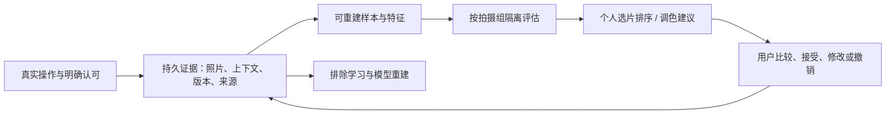

# 个人选片与调色学习方案

状态：长期产品与工程方案；“本轮基础”以源码和测试为准，其余阶段均未上线。默认面向个人摄影，并允许项目分别保留风格。项目目标不同，例如旅行记忆与商业交付，不能共用一个未经区分的“好照片”标签。

## 1. 根本目标与产品边界

Shadow 应逐步帮助用户以更少的重复劳动，得到符合自己意图的一组照片和成片。长期资产是可解释、可撤销、可以跨模型复用的个人判断记录，以及稳定的照片与调色语义。

成功指标应是保留重要照片、减少选片复核时间、降低调色返工量与保持整组一致性。评分更高、接受按钮点击更多、产生更多训练记录，都不自动意味着产品变好。

建议形成两条闭环：



选片先给可解释的组内建议；调色先给可以预览和撤销的建议节点。模型不修改原片，不自动写淘汰，不因一次建议被保留就把自己的输出包装成人工创作。

## 2. 当前源码事实

| 已有基础 | 尚缺的实际连接 |
| --- | --- |
| `shadow-ai/feedback` 保存呈现上下文、显式比较、排除学习事实 | 桌面比较候选目前写入 `feature: None`；严格训练入口会拒绝缺少冻结特征的比较。已有语义向量不能无条件补到历史事件上 |
| `shadow-catalog/decision` 保存人工选片、评分状态变化 | 当前状态和普通浏览不能证明用户在同一组里比较过哪些候选，不能直接生成成对负样本 |
| `LinearPreferenceHead` 已有轻量 CPU 更新算法 | 尚无完整训练任务、模型快照、数据版本、离线评估与发布/回退闭环；不是已上线个人排序 |
| Recipe 与 Library 编辑历史保存不可变状态和引用 | 自动保存、分支实验、历史恢复、导入预设与最终满意结果没有统一的训练认可边界 |
| Infer Runtime 已有图像语义、图像理解等消费者 | 内容相近不等于审美相近；Qwen 的语言评价不是用户标签；调用能力不等于长期个性化有效 |
| 现有暖编辑、RAW 与节点图语义 | 调色学习必须输出这些语义能准确执行的参数，不能绕过 RAW 高光或创造另一套渲染含义 |

入口：[`shadow-ai`](../../crates/shadow-ai/README.md)、[`反馈事实`](../../crates/shadow-ai/src/feedback/evidence.rs)、[`比较记录`](../../crates/shadow-desktop-bridge/src/review_service/comparison.rs)、[`Recipe 历史`](../../crates/shadow-domain/src/recipe/history.rs)。

## 3. 什么数据值得长期留下

将数据分成三层，避免反复迁移模型时丢掉人的判断：

1. **用户事实**：比较的左右候选、都保留/都不保留/无法比较、选片状态转换、明确认可的调色版本、建议接受后修改或撤销、排除学习。记录逻辑照片身份、事件顺序、项目、会话和发生时呈现的版本。保留事实不代表获准训练。
2. **派生样本**：事件到输入图像、源指纹、Recipe、特征、任务标签的确定映射；可丢弃重建。记录被排除原因，不能靠静默过滤掩盖覆盖不足。
3. **模型与评估**：数据集摘要、事件/撤销水位、特征空间、算法与参数版本、训练/验证划分、评估结果、有效范围、前一模型。每次建议带模型与数据版本，以便判断退化来自哪里。

### 信号解释

| 信号 | 合适用途 | 不应推出的结论 |
| --- | --- | --- |
| 同组明确选 A 而非 B | 较强组内偏好；仍需记录题目是选内容还是比较成片 | A 在所有项目或所有场景都更好 |
| 都保留 / 无法比较 | 保留差异、帮助识别比较边界 | 两张都差；随机生成胜负 |
| 喜欢、星级、入选 | 可作为正向候选和任务上下文 | 未标记的都是负例；不同人的 4 星尺度相同 |
| 普通缩略图单击、停留、放大 | 操作与质量诊断 | 用户喜欢、厌恶或接受该风格 |
| 明确认可某版调色 | 该输入、用途和上下文下的合适结果，包括不调整 | 每个中间保存版本都是监督目标 |
| 接受建议后再次修改 | 建议到最终版本的修正线索 | 每个参数回调都是独立样本 |
| 套预设、XMP 导入、批量同步 | 来源清楚的辅助样本；一批操作共用来源，控制总权重 | 成千上万份独立人工调色；参数与其他引擎同名就等价 |
| 导出 | 工作流结果或候选完成时机 | 唯一的满意确认；未导出的不受喜欢 |
| 排除学习 | 立刻阻止未来样本使用，并使受影响模型需要重建 | 删除照片和编辑历史；只跳过下次增量就完成了遗忘 |

历史补齐只做明确能证明的转换：原有比较保留原始呈现证据；无法恢复当时像素的记录标记缺失。已有调色版本可供用户批量挑选认可，但不能倒填“纯手工”或“当时看过”的事实。

## 4. 自动选片路线

分开四个判断，再做集合决策：

- **技术问题**：可比尺度下的模糊、曝光风险、遮挡等观测。区分源数据与显示代理，支持“不确定”；高 ISO、剪影、运动模糊未必是缺陷。
- **组内取舍**：先以拍摄时间、内容和人工可纠正的分组形成连拍/同场景组；只在可比的组里建议优先看哪些。
- **个人偏好**：冻结视觉特征，加已有小型成对排序头，学习用户在特定项目或题材中的残差。语义、色调和技术特征分别记录；SFace 等身份向量不能成为通用审美特征。
- **整组覆盖**：覆盖事件、视角、人物和叙事差异，约束重复数量；避免把一组分数最高的十张相似照片当作最好交付。独特或人工保护的照片不得被自动隐藏。

冷启动使用透明的技术/重复分组辅助；缺少有效个人数据时明确表示个人偏好尚不足。先用检索相似的已认可样本做解释，再评估小模型是否带来额外改善。项目模型默认独立；向通用个人模型汇总需要用户选择，不能将项目风格暗中推广。

排序输出“建议先看 A，B 可能重复；A 的技术依据、个人偏好依据和不确定性分别是什么”，保留切回原排序与展开全部。真实技术依据才能生成事实式解释，语言模型只负责表达，不补造检测结果。

对反复比较同一组、反向修改决定和成批操作，应按组和会话限制贡献。展示次序、模型建议与用户选择全部记录；不能让模型自己排前的照片获得更多曝光后，继续被当作天然更受欢迎。

## 5. 调色路线

### 从可靠的相似案例开始

先检索同题材、相近光线/动态范围和可兼容输入的已认可作品。将其“技术校正”和“创意风格”拆开：不能因为用户常拍偏暗 RAW，就推断用户永远喜欢增加固定曝光；也不能从夜景冷色推断肤色也要整体变冷。

首版建议只处理经过验证的全局语义参数，提供原始、建议和当前三个状态的比较。用独立节点表达，用户可以部分接受、调整强度、移除或恢复。局部蒙版、修复画笔、裁切和几何结构分别建模，不能把局部笔触位置直接迁移到另一张照片。

### 再做上下文条件下的参数建议

输入应包含规范开发基线、场景/光照、可比的亮度色彩统计、相机及输入颜色契约、当前 Recipe；目标为用户认可的最终输出与语义调整。固定源开发、相机配置、白平衡解释、共享节点版本、渲染版本与输出色域。保存前后 Recipe 摘要，不能只保存“曝光 +0.4”。

白平衡以现有物理与颜色契约为基础，不对跨相机 Kelvin 值直接求平均。保持传感器裁切和 RAW 高光恢复逻辑，学习模块只建议允许的编辑参数。高光 hue、彩色灯、肤色和预览/细节/导出一致性仍由 oracle 与渲染契约验证。

像素损失与参数损失都不是唯一答案：多种参数组合可能产生近似效果，多种风格也可能都可接受。优先学习可接受范围和少量风格候选，低置信度时不给强建议。非必要不直接微调整个图像基础模型。

## 6. 用户体验与数据控制

建议入口为“个人辅助”，分别控制“记录工作历史”“允许个人学习”“应用当前模型”，不要用一个 AI 总开关混在一起。

- 日常操作照常保存事实，不追踪每次鼠标运动用于学习；模型学习默认需单独启用。
- 完成精修后提供轻量的“把这个版本作为学习示例”，可注明风格或技术修正、当前项目和来源。确认绑定保存成功的确切版本；后续修改不移动已认可的目标。
- 初期可从已完成作品中选一小组作为启动样本；数量只是试验起点，不能显示虚构的“已学会百分比”。
- 只在价值高且用户愿意时提供少量比较；不打断调色、不强迫每天训练。允许都保留和跳过。
- 查看学习记录、排除一条/一组/项目、暂停学习、清除派生模型、恢复上一模型。排除操作不能删除原片与作者历史。
- 多人共用设备时以明确身份分区；当前 `Global` 只表示本地 Catalog 的通用范围，并非已经实现多用户隔离。正式开启训练前必须补齐身份策略。

## 7. Infer Runtime 与执行架构

Shadow 负责照片/Recipe 身份、用户事实、样本选择、学习权限、评估与建议接受；Infer Runtime 负责已声明的推理能力、特征模型版本、资源调度、取消与模型安装。语义推理契约不能冒充训练接口。

现有小型线性偏好头可在 Shadow 的后台 CPU 工作线程训练；若后续使用神经网络微调，则需要独立明确的训练作业与模型产物契约，不能拼一个未登记的本地 Python 旁路。

渲染和交互优先；只在后台有限队列中提取特征和学习，按电源、内存、温度及用户操作暂停。缓存以照片源指纹、规范输入、Recipe/呈现版本、特征空间和预处理版本组合，不以文件路径作为身份。普通滑块调整不得重复提取多张图像特征，不在交互渲染路径加入额外读回。

本地照片、比较结果和个人参数默认留在本机。本轮没有上传、自动训练或跨用户汇总。同步若实施，首先同步可审计用户事实并解决身份和撤销传播；模型是可重建产物，不能把远端模型权重当作有权覆盖本地偏好的事实。

## 8. 验证有效，才能默认启用

数据按完整拍摄组和时间划分训练/验证，不能把同一连拍、同一照片不同裁切或不同调色版本拆进两边。冻结的特征提取也要防止将认可后的成片作为预测原片选片结果的输入，造成标签泄漏。

| 任务 | 必须评估 |
| --- | --- |
| 选片 | 在相同复核压缩比下的保留片召回、组内排序、独特/保护照片误隐藏为零、复核时间、人工改判率 |
| 调色 | 独立盲比接受率、最终调整距离和返工时间、整组一致性、色彩与高光回归、未建议相对坏于基线的比例 |
| 个性化 | 无个人模型与个人模型的对照、按项目/相机/光照/题材分层表现、跨时间漂移、低样本或分布外的拒答 |
| 系统 | 前台交互影响、冷热延迟、峰值内存、取消、重复作业幂等、离线恢复、撤销后模型失效与重建 |

先后台评估不改变用户排序，再小范围显式启用；只有留出拍摄组上的指标和人工盲比都更好，才能提升为默认模型。记录区间与样本覆盖，不能以固定几十次点击保证学会。保留少量不受当前模型排序影响的评估任务，以发现反馈循环。

## 9. 实施阶段

| 阶段 | 交付 | 准入标准 |
| --- | --- | --- |
| 本轮基础 | 显式调色认可事实、来源/用途区分、同照片配方归属校验、分页就绪报告、撤销复用、CLI | 不改变既有历史；错误引用拒绝；缺特征明确列出；跨项目和已撤销证据不入样本 |
| 下一步 P1 | 桌面认可入口与学习设置；准确保存时机；样本浏览/排除；采集来源关联 | 真实窗口完成确认、再编辑、撤销、重开；历史版本不被暗中移动 |
| P1 | 规范输入特征物化、历史呈现恢复、源/特征/Recipe 数据集清单与稳定摘要 | 旧特征空间不可混用；缺源与撤销会阻止模型发布；跨照片组不泄漏 |
| P2 | 相似样本辅助与成对小模型离线评估；按组去重和权重 | 在未见拍摄组上胜过无个人模型，说明有效范围 |
| P2 | 全局参数建议节点；原始/建议/当前对比；分项目风格 | 渲染契约与 RAW oracle 保持；可撤销；人工返工量下降 |
| P3 | 整组覆盖、项目内一致性、局部调整、跨设备事实同步 | 先完成相应身份、来源、撤销与评估契约，不按日历强行上线 |

## 10. 本轮基础的操作入口与限制

源码：[`readiness`](../../crates/shadow-ai/src/feedback/readiness.rs)、[`Catalog 证据`](../../crates/shadow-catalog/src/feedback.rs)、[`CLI`](../../apps/shadow-cli/src/learning.rs)。

```text
shadow-cli learning-report <catalog.sqlite> <global|project:id> <after-sequence>
shadow-cli learning-confirm-edit <catalog.sqlite> <scope> <photo-id> <baseline-commit> <approved-commit> <manual|imported|assisted|mixed|unknown> <style|correction>
shadow-cli learning-forget <catalog.sqlite> <event-id>
```

报告最多读取 512 条事件，以 `has_more` 和 `next_after_sequence` 分页，撤销查询限制在本页事件区间；配方校验和撤销读取在同一个 SQLite 读事务中完成。它是当前页的引用清单，不是训练完成或模型可发布的证明。`feature_artifacts_verified` 与 `training_performed` 当前始终为 false；缺失配方会列入 `unavailable_edit_event_ids`。已认可引用本身不代表图像特征、完整源数据或稳定渲染输出已经可用。

认可命令是明确的人工操作，来源与用途由操作者声明；不伪造 GUI 已呈现像素的回执。前后配方可相同，以表达无需调整；自动保存、导出和普通评分不会调用它。写入和排除操作只用于明确选择的事件，未对现有用户图库批量生成认可标签。

命令要求已有 Catalog，采用正常的受支持打开/迁移流程，不执行开发期重置。新反馈动作扩展了 JSON 语义，旧二进制可能不能读取含该动作的反馈历史；旧事件字节不变。本轮尚未建立新的训练模型持久存储，因此排除操作只证明未来取样排除，不能声称完成对已有模型的机器遗忘。

## 11. 研究依据与采用范围

[MIT-Adobe FiveK](https://data.csail.mit.edu/graphics/fivek/) 保留 RAW、五位修图者的结果、滑块和调整历史，支持“输入、上下文、作者与最终结果需要一起保存”的设计依据。这里只参考数据结构，不下载或默认获得其训练使用权限。

[AADB 排序研究](https://arxiv.org/abs/1606.01621) 区分内容属性与相对偏好，并保留评分者身份以利用同一人的判断一致性。因此，本方案建议同用户、同任务语境的相对比较；这不是对 Shadow 的效果保证。

[可接受调色范围研究](https://projects.csail.mit.edu/acceptable-adj/) 讨论同一图像可以有多种可接受亮度/对比度结果。因此，本方案选择可接受范围与候选比较作为设计方向，而非假设每张照片只有一组正确滑块值。具体参数学习与产品验收仍需 Shadow 自身数据验证。
