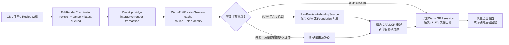

# 交互编辑管线契约

Shadow 的编辑体验不是“某些滤镜跑在 GPU 上”，而是：每一次参数拖动都只重算它真正影响的
最小后缀，并把该后缀连续地留在适合呈现的执行域中。预览、细节和导出可以选择不同的质量
和缓存策略，但必须遵循同一份不可变 Recipe、同一来源事实与同一颜色/几何语义。

本契约约束所有会改变画面并需要即时反馈的工作，包括 RAW 开发与重绑、基础/局部/几何
节点、蒙版、Liquify、暖预览会话、Metal/CPU 回退、Qt 调度和预览缓存。它不替代各所有者
的源码说明；当前实现的事实以源码、收据、测试和可运行产物为准。

## 先读哪里

| 关注点 | 当前责任入口 |
| --- | --- |
| RAW 来源准备、CFA/基础图像重绑、DCP 与收据 | [`cpp/shadow-image/README.md`](../../cpp/shadow-image/README.md)、[`raw_preview_rebinding.cpp`](../../cpp/shadow-image/src/raw/raw_preview_rebinding.cpp) |
| 有界预览源和暖会话构建 | [`warm_edit_preview.cpp`](../../cpp/shadow-image/src/proxy/warm_edit_preview.cpp) |
| 常驻 GPU 输入、边表与呈现表面 | [`warm_edit_gpu.hpp`](../../cpp/shadow-image/src/proxy/warm_edit_gpu.hpp) |
| 跨语言预览缓存、RAW 重绑准入和渲染事务 | [`crates/shadow-desktop-bridge/README.md`](../../crates/shadow-desktop-bridge/README.md)、[`warm_session_cache.rs`](../../crates/shadow-desktop-bridge/src/edit_preview/warm_session_cache.rs)、[`service.rs`](../../crates/shadow-desktop-bridge/src/edit_preview/service.rs) |
| Qt 拖动调度、取消和过期结果抑制 | [`edit_render_coordinator.cpp`](../../apps/desktop/src/edit_render_coordinator.cpp) |

涉及这些区域的任务必须先使用项目内的 `$shadow-interactive-rendering` skill。它要求在改动
前把本页的约束映射为该参数的实际失效路径。

## 当前链路与已知边界

当前 RAW 白平衡的窄重绑已经保留经过允许处理的 CFA 或 Foundation 基底；色温/色调变化
不得重新打开解码器、读取 Foundation、重复去噪或重新上传原始传感器数据。为了保持与
完整 RAW 路径相同的 CFA/DCP 语义，它不是“在已去马赛克 RGB 上乘一个色偏”的捷径。

但不要把这一事实误称为端到端零传输：当前重绑仍会形成新的有界 scene-linear 预览源，再
构建暖 GPU 会话。这是已知的下游接缝。后续优化若要消除它，必须以
`WarmEditGpuAdoptedSource` 的同设备输入、生命周期、预算和像素/收据等价证明为准，而不是
以改变白平衡算法来换取速度。

## 不可违反的约束

### 1. 先定义失效边界，再写实现

每个可交互参数必须有一个明确的输入域和最小失效后缀：

| 改动类别 | 允许重算 | 必须复用 | 不得作为默认结果 |
| --- | --- | --- | --- |
| 普通 Grade、曲线、颜色、局部强度 | 该节点及其后续显示变换 | 同一暖预览输入、GPU 边表和不相关节点资源 | 重开文件、重解码、重建前置来源 |
| RAW 色温/色调 | 相同来源预览的精确 RAW 重绑、其后续色彩/显示阶段 | 保留的 CFA 或 Foundation 基底、去噪结果、DCP/相机输入事实 | 已去马赛克 RGB 伪白平衡、重解码、重去噪、重读模型 |
| Foundation 强度 | 同一已验证原始/AI 基底的混合与后续阶段 | Foundation 身份、模型结果、来源准备 | 重新推理模型或把强度塞入 Foundation 身份 |
| 裁剪、透视、光学、Liquify、蒙版 | 受影响的几何/采样/合成后缀 | 已确认的来源与不相关常驻资源 | 无理由地重新进入解码/来源准入 |
| 来源、质量、opcode、去噪、高光策略、基础图像或光学事实 | 完整且明确的来源准备 | 仅可复用仍与新计划等价的事实 | 假装是窄重绑，或静默沿用旧收据 |

“现在无法证明更窄”可以暂时走安全的完整路径，但必须在变更说明中标成性能债，说明阻断
它的事实、传输或等价性条件；不能把全路径重建包装成普通的 slider 更新。

### 2. GPU 是连续事务，不是终点标签

- 有可用 GPU 路径时，来源输入、节点副资源和输出应尽量同设备常驻；不要为中间结果作无
  用的主机读回，再立即上传。
- 主机物化只允许发生在明确需要字节的消费者、便携回退或持久化边界。每一次跨域都要在
  设计说明中写出方向、格式、尺寸、频率和无法避免的原因。
- 复用已存在的 `WarmEditGpuAdoptedSource`、常驻曲线/LUT/蒙版/Liquify 边资源和双输出槽，
  不要为一次参数事件创建无界的纹理、buffer 或临时副本。
- GPU 不可用、内存预算不足或语义不受支持时可以回退或失败，但必须保留来源/Recipe 的
  语义和可解释收据；不得静默改成不同颜色路径或私有 provider RGB 近似。

### 3. 拖动是一个可取消的最新值流

- GUI 线程只负责采样、排队、取消和发布；解码、重绑、着色、分析、缓存和大内存操作不得
  阻塞它。
- 每个手势事件都带有 revision/cancellation 语义。运行中的旧任务可被取消，队列只保留
  最新快照，过期任务永远不能覆盖更新的画面。
- `Interactive` 仅交付瞬时画面，不做直方图/传感器诊断/持久预览发布；`Settled` 或显式
  提交才补齐分析和耐久缓存。不要为了“最终完整”而让每个拖动事件同步做这两类工作。
- 任何防抖、节流或首帧策略必须保证首个可见响应不被连续移动无限推迟，并明确记录其
  延迟和合并规则。

### 4. 预览快不允许改变摄影语义

- Preview、detail 与 export 使用同一不可变 Recipe 语义；有界预览可降低分辨率/质量，但
  不能重复白平衡、跳过已声明的 DCP，或把近似路径伪装为完整结果。
- 缓存键和收据必须区分来源身份、有效 RAW 计划、Foundation 身份/强度、色彩/几何输入与
  质量策略。可重绑的字段只能在已证明的同来源会话中复用。
- 私有 provider 的暂存 RawFrame 必须在预览会话准入时建立；手势期间不应重新启动 provider、
  读取文件或加载模型。
- 失败要显式呈现并保留已有正确画面；不得发布半旧半新的帧、错误匹配的缓存或“看起来可用”
  的色彩回退。

### 5. 常驻资源必须有生命周期和预算

- 明确资源的所有者、来源身份、失效条件、CPU/GPU 双端保留策略和释放点。
- 一个常驻会话只复用与当前来源/计划相等或经窄重绑验证等价的输入；禁止跨照片、跨收据或
  跨基础图像借用。
- 内存压力下优先降级/驱逐暖资源，不能通过移除身份校验、全局锁住 UI 或保留无界历史来
  “修复”性能。

## 每次改动前必须写出的最小路径说明

在任务说明、设计记录或 PR 中，用下列项目回答；没有答案时先补来源分析：

1. **参数域**：它改变的是 RAW 来源、几何、像素节点、显示还是持久化策略？
2. **复用输入**：哪些 CFA、Foundation、scene-linear、GPU buffer、边表或收据必须保持？
3. **失效前沿**：从哪个节点/阶段开始重算，为什么前面的阶段仍等价？
4. **跨域**：本次交互有几次 CPU↔GPU 传输；每次的格式、大小和频率是什么？
5. **取消与发布**：怎样保证最新 revision 才可见，旧任务在哪些点观察取消？
6. **缓存/身份**：哪些键变化，哪些重绑字段不进入可复用基础身份？
7. **一致性**：preview 与 detail/export 的允许差异是什么，如何证明没有改变算法语义？
8. **证据**：最窄的所有者测试、真实后端/回退覆盖和一次有名设备上的交互测量是什么？

## 验证要求

以风险相称的方式验证，不为文档或局部行为重复全仓库构建。改变交互管线时，至少选择与改动
相符的证据：

- 为失效边界建立/更新所有者测试：连续 N 次调整不得重复打开源、重复去噪、重读 Foundation
  或误用过期会话；允许完整重建的类别则必须验证其准入原因。
- 验证最新值取胜、取消后不发布旧帧、Interactive 不发布耐久结果、Settled/提交才更新缓存。
- 有 Metal 时测试真实设备输入/呈现或受控回退；没有 Metal 时不得把 CPU 通过误称为 GPU
  连续性证据。
- 对新增或改变的跨域边界，记录设备、预览边长、策略、连续事件数及 p50/p95 响应时间；
  数值用于发现回归，不取代像素、收据和身份正确性。
- 当优化引入新 GPU 直连时，新增与既有精确路径的像素/收据/颜色变换等价证据，再允许它
  成为默认路线。

## 变更审查问题

审查者应能回答：这次 slider 事件最远会回到哪里？为何不会更早？GPU 是否仍是一条连续链？
失败或取消时用户会看见什么？缓存是否仍对应正确的 Recipe 和来源？如果任一答案只能是
“因为它通常很快”或“因为已经上 GPU”，该改动尚未满足本契约。
